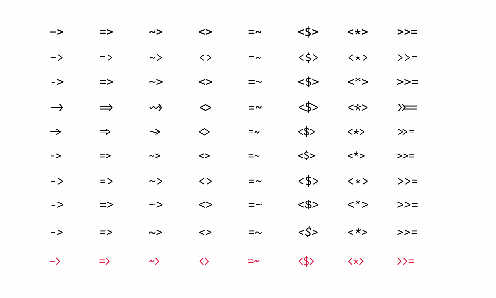

Do you ever feel like your font treats symbols as second-class glyphs? Are you frustrated that `->` looks nothing like an arrow, and `$`, `@`, `%` seem ever mismatched?

Want to experience the beauty of ligatures without losing the simplicity of ASCII?

**Myna** (*Gracula religiosa* 🐦‍⬛) is a monospace font which aims to bring harmony to your editor by treating symbols as first-class glyphs alongside alphanumeric characters.

## Why Myna?
Myna was borne out of a need to scratch a persistent typographical itch. While I've tried many otherwise well-crafted monospace fonts, I always found myself wanting to tweak a glyph here or adjust a shape there. After developing Myna and using it almost exclusively in my professional and personal work, I'm sharing it as a small contribution to the wonderful community of monospace typography enthusiasts.

Here are a few of its attractive features that might make it your next favourite monospace font:
- **Symbol-First Design**: clear emphasis on ASCII symbols which are ubiquitous in programming languages
- **Near-Perfect Alignment**: multi-character symbols like `->`, `>>=`, `=~`, `::` align seamlessly
- **Balanced Weight**: symbols have just the right visual weight against your code
- **Minimalist Forms**: geometric shapes for quotes and commas
- **Clear Distinction**: no more confusing `1 l I |` or `0 O o`
- **Language-Aware Design**: clean sigils for Perl + elegant operators for Haskell + clear symbols for C

NB: Myna is designed to be a simple font. The current release is a single weight without ligatures, though future updates may expand its features if demand arises. It does work out nicely with synthesised bold generated by fontconfig and pango on Linux.

## Showcase
<picture>
  <source media="(prefers-color-scheme: dark)"  srcset="images/Perl_dark.png">
  <source media="(prefers-color-scheme: light)" srcset="images/Perl_light.png">
  
</picture>

<picture>
  <source media="(prefers-color-scheme: dark)"  srcset="images/C_dark.png">
  <source media="(prefers-color-scheme: light)" srcset="images/C_light.png">
  
</picture>

Here is a comparison between some popular monospace fonts with Myna (at the bottom in red). The list of the fonts used could be found in the script [mkcomp](scripts/mkcomp). Myna tries to emulate the smooth look of ligatures but also retains the simplicity of ASCII.



Please click on the images below to view it in full in a new tab.

| Language | Light | Dark |
|----------|-------|------|
|  **Perl**     |    |    |
|  **Haskell**  |    |    |
|  **C**        |    |    |
|  **Bash**     |    |    |
|  **Clojure**  |    |    |
|  **Erlang**   |    |    |
|  **OCaml**    |    |    |
|  **Rust**     |    |    |
|  **LaTeX**    |    |    |
|  **HTML**     |    |    |
|  **SQL**      |    |    |

## Installation
### Linux
```bash
git clone https://github.com/sayyadirfanali/Myna.git
cd Myna
cp Myna.otf ~/.local/share/fonts/
fc-cache -v
```

### macOS
```bash
git clone https://github.com/sayyadirfanali/Myna.git
cd Myna
cp Myna.otf ~/Library/Fonts/
```

### Windows
1. Download the release
2. Right-click `Myna.otf` and select "Install for all users"

## License
SIL Open Font License, Version 1.1

## Credits
Myna started out as [Hera](https://github.com/sayyadirfanali/Hera.git) which was a customised version of Source Code Pro but now has come a long way after stealing many beautiful designs from Fira Mono, Inconsolata, Plex Mono, Office Code Pro, Anonymous Pro. Detailed credits could be found in the Hera repository.

Code banner and illustrations were produced using ImageMagick and [Ray.so](https://ray.so).

## Future
Myna is designed to be used universally in every kind of terminal and editor. I've tried to include a reasonable subset of non-ASCII glyphs (mostly geometrical and mathematical characters). However, I'm considering expanding it based on community interest and would welcome contributions in these areas:
- Bug Reports: spacing and kerning issues, rendering problems, unavailable/incorrect glyphs
- Feature Requests: suggest new glyphs or features via GitHub Issues

Please feel free to open issues and also contact me at irfan@irfanali.org.
