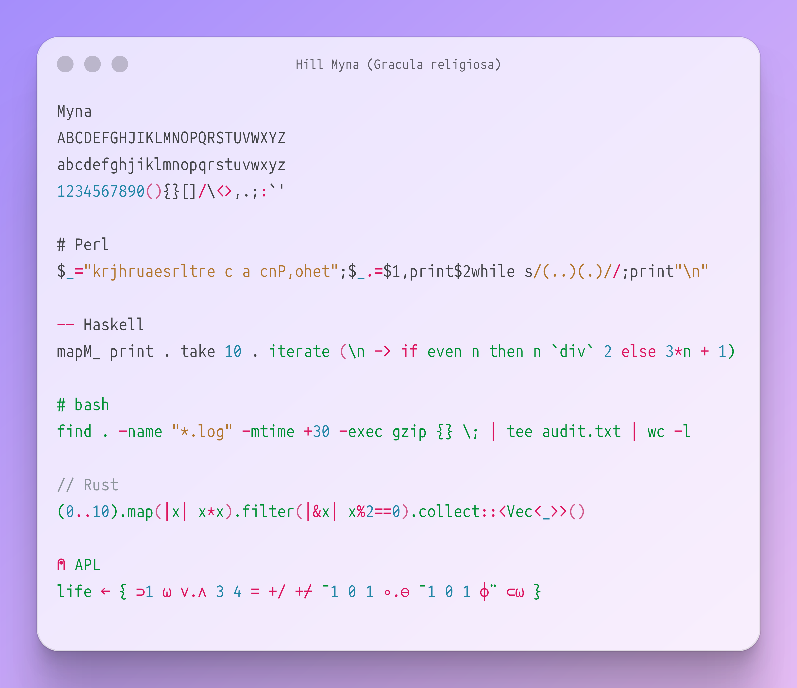
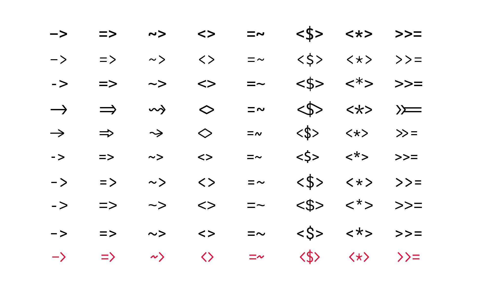

<picture>
  <source media="(prefers-color-scheme: dark)"  srcset="images/banner_dark.png">
  <source media="(prefers-color-scheme: light)" srcset="images/banner_light.png">
  
</picture>


Do you ever feel like your font treats symbols as second-class glyphs? Are you frustrated that `->` looks nothing like an arrow, and `$`, `@`, `%` seem ever mismatched?

Want to experience the beauty of ligatures without losing the simplicity of ASCII and getting tangled in the web of ligature-compatible terminal emulators?

**Myna** ((_Gracula religiosa_)[https://en.wikipedia.org/wiki/Common\_hill\_myna]) is a monospace font which aims to bring harmony to your editor by treating symbols as first-class glyphs alongside alphanumeric characters.

NB: Please don't mind the colorscheme in the banner above. I just picked it because it highlighted the most colors in Ray.so. Since the banner contains multiple languages, no single colorscheme could properly highlight them in one image.

## Why Myna?
Myna was born of a need to scratch a persistent typographical itch. While I've tried many otherwise well-crafted monospace fonts, I always found myself wanting to tweak a glyph here or adjust a shape there. After developing Myna and using it almost exclusively in my professional and personal work, I'm sharing it as a small contribution to the wonderful community of monospace typography enthusiasts.

Here are a few of its attractive features that might make it your next favourite monospace font:
- **Symbol-First Design**: clear emphasis on ASCII symbols which are ubiquitous in programming languages
- **Near-Perfect Alignment**: multi-character symbols like `->`, `>>=`, `=~`, `::` align seamlessly
- **Balanced Weight**: symbols have just the right visual weight against your code
- **Minimalist Forms**: geometric shapes for quotes and commas
- **Language-Aware Design**: clean sigils for Perl + elegant operators for Haskell + clear symbols for Rust (and even APL)
- **Clear Distinction**: no more confusing `1 l I |` or `0 O o`

<picture>
  <source media="(prefers-color-scheme: dark)"  srcset="images/comp_dark.png">
  <source media="(prefers-color-scheme: light)" srcset="images/comp_light.png">
  
</picture>

## Installation
Myna features Regular, Medium, Bold weight with faux Italic variants for all of them. In order to download them, please download the released zip files or clone the repo and then copy the relevant fonts from the folder `fonts/` into the font directory in your OS.

### Linux
```bash
git clone https://github.com/sayyadirfanali/Myna.git
cd ./Myna/fonts
cp *.otf ~/.local/share/fonts/ # do NOT copy all files (read note above)
fc-cache -v
```

### macOS
```bash
git clone https://github.com/sayyadirfanali/Myna.git
cd Myna
cp Myna.otf ~/Library/Fonts/ # do NOT copy all files (read note above)
```

### Windows
1. Download the release
2. Right-click `Myna.otf` and select "Install for all users"

NB: I've added a one-liner script `mknerdfont` to attach NerdFont glyphs into any variant. I've also released the Regular variant with NerdFont. You can use to script to run on any variant/weight to get a NerdFont-compatible version. You'd need `[fontpatcher](https://github.com/ryanoasis/nerd-fonts?tab=readme-ov-file#font-patcher)` installed for `mknerdfont` to work.

NB: I've also added a script `changeheight.py` to increase/decrease vertical spacing (in response to #9). You can use it if you want more vertical compactness in your terminal.

NB: The latest release (v2.0.0) features contextual variants for a few glyph pairs (eg, `|>`, `:=`) in response to #1 and #6. You'd need a terminal which can work with font features to be able to display them.

## License
SIL Open Font License, Version 1.1

## Credits
Myna started out as [Hera](https://github.com/sayyadirfanali/Hera.git) which was a customised version of Source Code Pro but now has come a long way after stealing many beautiful designs from Fira Mono, Inconsolata, Plex Mono, Office Code Pro, Anonymous Pro. Detailed credits could be found in the Hera repository.

Code banner and illustrations were produced using ImageMagick and [Ray.so](https://ray.so).

## Future
Myna is designed to be used universally in every kind of terminal and editor. I've tried to include a reasonable subset of non-ASCII glyphs (mostly geometrical and mathematical characters). However, I'm considering expanding it based on community interest and would welcome contributions in these areas:
- Bug Reports: spacing and kerning issues, rendering problems, unavailable/incorrect glyphs
- Feature Requests: suggest new glyphs or features via GitHub Issues

Please feel free to open issues and also contact me at irfan@irfanali.org.
